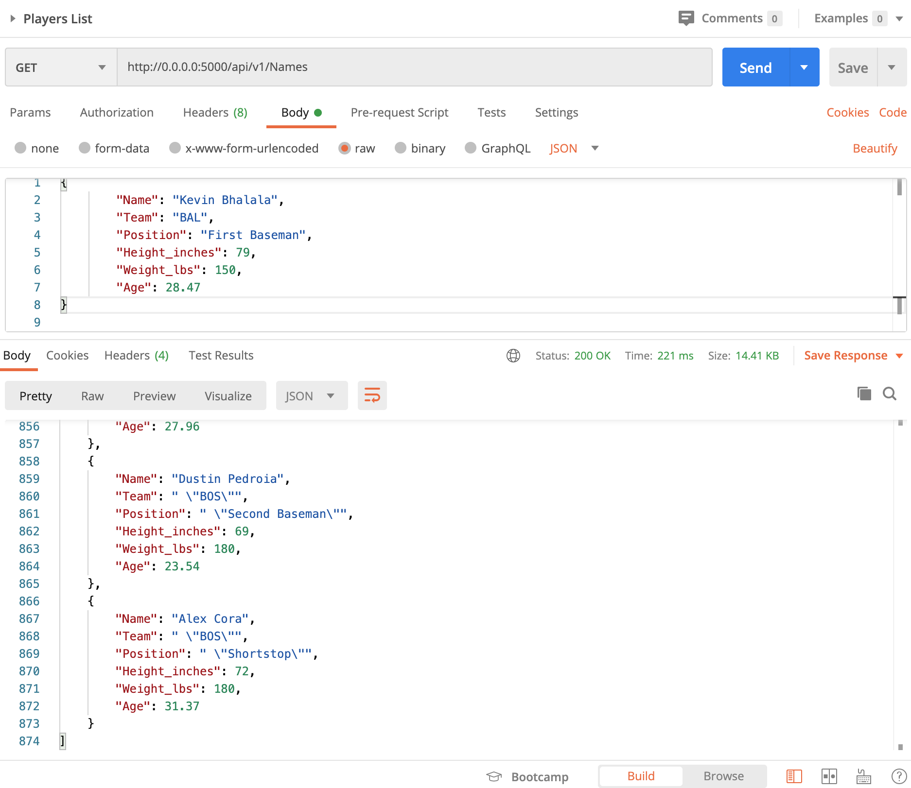

# Project Description
This project contains information for rest api and different functions in postman like GET, POST, PUT, DELETE.

# Postman Screenshot

# Postman GET Request

# Postman POST Request

# Postman POST Request Result

# Postman PUT Request

# Postman PUT Request Result

# Postman DELETE Request

# Postman DELETE Request Result

